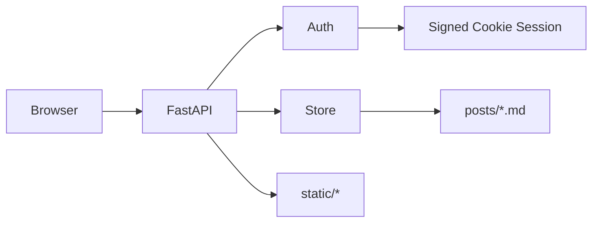

# 架构设计：墨记开放 Markdown Blog v1.3

> 对应 PRD：`docs/PRD-markdown-blog-v1.md`  
> 技术选型：FastAPI + Uvicorn；文章以 `posts_dir/**/*.md`（默认仓库外 `doc/`）落盘。

---

## 1. 目标与约束

- **读开放、写登录**：访客公开读目录下全部 `.md`；作者预置账号登录后写。
- **无状态管理**：不区分草稿/发布；落盘即可见。
- **相对媒体**：`posts_dir` 经 `/media` 静态挂载；正文相对路径按文章目录解析。
- **单 worker**：文件存储避免多进程写冲突。

---

## 2. 分层与目录

```text
markdown-note/
├── app.py              # 接入层：组装应用、挂载静态、健康检查
├── config.py           # 配置层：环境变量
├── auth.py             # 业务：登录会话校验
├── store.py            # 数据层：Markdown 读写
├── schemas.py          # 请求/响应模型
├── settings.json       # 账号与 posts_dir（默认 ../doc）
├── static/             # 前端页面与资源
├── docs/               # PRD / 架构 / 部署 / 自测
├── tests/              # 单元/接口测试
├── requirements.txt
└── README.md
```

数据根：仓库外 `doc/**/*.md`，按相对路径构建目录树。

| 层 | 职责 | 禁止 |
|----|------|------|
| 接入 `app.py` | 路由注册、静态、中间件 | 直接拼 frontmatter / 文件 IO 细节 |
| 业务 `auth.py` | 登录、会话依赖 | 操作磁盘文章 |
| 数据 `store.py` | 解析/写入 `.md` | 感知 HTTP |
| 工具 `config.py` | 配置读取 | 业务逻辑 |

---

## 3. 模块关系



---

## 4. API 设计

| 方法 | 路径 | 鉴权 | 说明 |
|------|------|------|------|
| GET | `/api/health` | 否 | 探活 |
| GET | `/api/auth/me` | 可选 | 当前登录态 |
| POST | `/api/auth/login` | 否 | 登录 |
| POST | `/api/auth/logout` | 是 | 退出 |
| GET | `/api/posts` | 否 | 全部 `.md` 列表（可 q/tag/category） |
| GET | `/api/posts/all` | 是 | 作者侧列表（数据与公开一致） |
| GET | `/api/posts/{id}` | 否 | 任意已落盘文章详情 |
| POST | `/api/posts` | 是 | 新建 |
| PUT | `/api/posts/{id}` | 是 | 更新（标题/正文/标签/目录） |
| DELETE | `/api/posts/{id}` | 是 | 硬删 |
| GET | `/api/categories` | 否 | 目录树（由含 md 的子路径生成） |
| GET | `/media/...` | 否 | 挂载 `posts_dir`，提供 md 相对引用的图片/附件 |

页面：`/` 列表、`/post.html?id=` 详情、`/login.html`、`/editor.html` 工作台（支持 `?id=` 深链打开指定文章）。  
详情/预览：将正文相对 `src`/`href` 改写为 `/media/{文章目录}/...`。  
已登录时：`post.html` 与首页浮动阅读器展示「编辑」→ `/editor.html?id=`。

---

## 5. 数据模型（Markdown + frontmatter）

```yaml
---
id: p_xxx
title: "标题"
tags: ["可选"]
createdAt: 1710000000000
updatedAt: 1710000000000
---

正文 Markdown…
```

**规则**：无 frontmatter 的纯 `.md` 同样可读（文件名作标题）；历史 `status` 字段忽略；单篇 ≤ 2MB；分类=相对 `doc/` 的父目录路径。

---

## 6. 认证方案

- Starlette `SessionMiddleware` + 服务端校验用户名密码（环境变量预置）。
- Cookie：`HttpOnly`；生产 `Secure`（`SESSION_HTTPS_ONLY=true`）。
- 写接口统一 `Depends(require_author)`，未登录 401。

---

## 7. 前端结构

| 页面 | 职责 |
|------|------|
| `index.html` | 公开文章流 |
| `post.html` | 详情渲染（marked + DOMPurify） |
| `login.html` | 作者登录 |
| `editor.html` | 侧栏列表 + 编辑预览 + 保存/删除 |

复用墨记编辑预览体验；无草稿态。

---

## 8. 部署要点

见 `docs/DEPLOY-fastapi-uvicorn.md`：systemd + Nginx，Uvicorn 绑定 `127.0.0.1:8000`，`--workers 1`。

---

## 9. 扩展预留

- 开放注册 / 多作者 → `store` 增加 `author` 字段，鉴权换用户表。
- 评论 → 可迁 SQLite，API 路径保持兼容。

---

*状态：v1.2 · 无状态扫盘*
