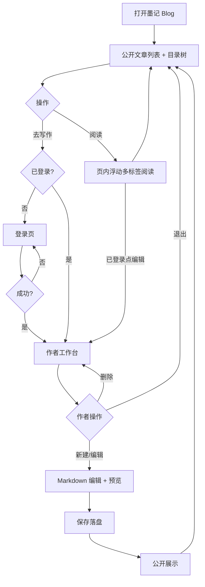

# PRD：墨记 · 开放 Markdown Blog v1.3.4

> 由本地 `markdown-notepad` 简化演进为**开放 Blog**：访客可直接读，作者登录后写。  
> **v1.2**：取消草稿/发布状态；目录下所有 `.md` 对访客可见。  
> **v1.3**：相对路径图片/附件经 `/media` 按文章目录解析。  
> **v1.3.4**：已登录阅读文章时提供「编辑」，一键进入工作台打开该文。

---

## 1. 需求背景与解决痛点

| 痛点 | 目标 |
|------|------|
| 笔记只在本机，无法公开分享 | 任何人可在线阅读 `doc/` 下 Markdown |
| 本地编辑器无「站点感」 | 首页文章流 + 目录树 + 单篇详情页 |
| 草稿状态与外部笔记不同步 | **无状态管理**：落盘即可见 |

**一句话**：轻量 Markdown 博客——扫盘展示目录下全部 `.md`，登录后可写删。

---

## 2. 目标用户与使用场景

| 角色 | 场景 |
|------|------|
| 访客（未登录） | 浏览目录树、文章列表、打开阅读 |
| 作者（已登录） | 新建 / 编辑 / 改目录与标签 / 删除 |

**典型路径**：打开站点读文 →（作者）登录 → Markdown 编辑保存 → 即时公开展示。

---

## 3. 核心功能清单

### 3.1 必填（MVP）

| ID | 功能 | 说明 |
|----|------|------|
| F1 | 登录 / 退出 | 作者账号；MVP 预置账号，不做开放注册 |
| F2 | 公开文章列表 | 首页按更新时间展示 **全部** `.md` |
| F3 | 公开文章详情 | 渲染 Markdown；无需登录 |
| F4 | 写稿与保存 | 新建 / 编辑；实时预览；无草稿态 |
| F5 | 删除 | 作者硬删 |
| F6 | 目录树 | 按相对 `doc/` 的子目录分类筛选 |
| F7 | 相对路径媒体 | md 内相对图片/附件按文章所在目录解析，经 `/media` 提供 |
| F8 | 页内浮动多标签 | 首页点击文章在**页内浮动框架**多标签打开，不新开浏览器窗口；可切换/关闭标签 |
| F9 | 阅读页编辑入口 | **仅已登录**：详情页 / 浮动阅读器显示「编辑」；点击进入工作台并打开当前文章（`/editor.html?id=`） |

### 3.2 明确砍掉（本版不做）

草稿/发布状态、回收站、快照容灾、zip 导出、用户隔离私密笔记、注册、协作、评论。

---

## 4. 用户流程图

---

## 5. 输入输出、边界与禁用

| 项 | 规则 |
|----|------|
| 阅读 | `posts_dir` 下所有 `.md`（跳过 README / 隐藏路径）对访客可见 |
| 编辑入口 | 未登录不展示「编辑」按钮；已登录可见，跳转 `/editor.html?id={当前文章id}` |
| 写作 | 未登录禁止创建 / 修改 / 删除 |
| 标题 | 必填；正文 UTF-8 Markdown；单篇建议 ≤ 2MB |
| 目录 | 相对 `doc/` 子路径；空=根目录 |
| 媒体 | 正文相对路径（如图 `附件资源/xxx/img_1.png`）相对**文章所在目录**解析；HTTP(S)/data 外链不改写 |
| 删除 | 二次确认后硬删 |

**边界**：登录失效时写操作 401；不存在的 id → 404。  
**禁用**：匿名发文、草稿态、私密笔记空间、富文本编辑器。

---

## 6. 版本迭代

| 版本 | 范围 | 成功标准 |
|------|------|----------|
| **v1.0** | F1–F5 + draft/published | 访客可读已发布文；作者可登录写发删 |
| **v1.1** | 搜索 / 标签 / 目录树 | 可按关键字、标签、目录筛选 |
| **v1.2** | **去掉状态管理** | 目录下全部 md 公开；无草稿/发布 |
| **v1.3** | **相对路径图片/附件** | `/media` 挂载 doc；详情/预览按文章目录改写 |
| **v1.3.1** | 布局对齐 + 多标签打开 | 顶栏同宽；列表曾用新窗口 |
| **v1.3.2** | **页内浮动多标签** | 浮动框架内多标签读文，非新窗口 |
| **v1.3.4** | **阅读页编辑入口** | 登录后详情/浮层「编辑」→ 工作台打开该文 |
| **v1.3.5** | **去首页介绍块 + 护眼淡绿主题** | 去掉「公开阅读…」模块；全局淡绿护眼色调 |
| **v2.0** | 开放注册 / 多作者 / 评论 | 多人协作与互动 |

---

## 7. 验收清单

- [ ] 未登录可浏览列表与任意已落盘 `.md` 正文
- [ ] 子目录在左侧目录树中可见（含无墨记 frontmatter 的文件）
- [ ] 未登录无法进入写稿或改删
- [ ] 新建保存后访客立即可见；删除后不可见
- [ ] 工作台无草稿/发布切换
- [ ] 文章内相对路径图片可显示（如微信导出 `附件资源/...`）
- [ ] 首页点击文章在页内浮动框架打开；可同时开多篇并切换标签
- [ ] 关闭标签后列表仍在；不强制新开浏览器窗口
- [ ] 未登录：详情页 / 浮动阅读器无「编辑」按钮
- [ ] 已登录：显示「编辑」，点击后工作台打开对应文章
- [ ] 首页无「公开阅读，登录写作」介绍模块
- [ ] 站点整体为护眼淡绿色调（非暗黑）

---

*文档状态：v1.3.5 · 护眼淡绿主题*
